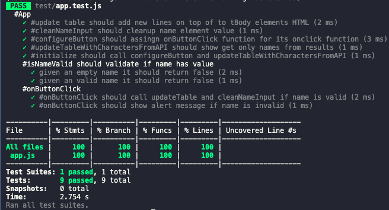
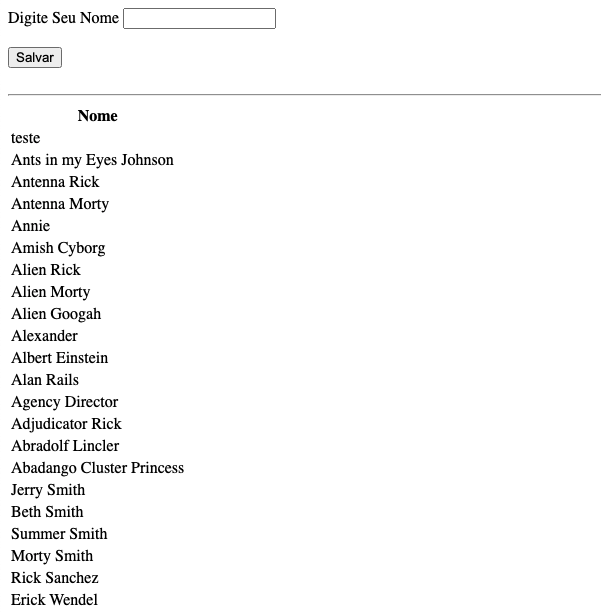

# Example of Unit Testing on the Browser with JavaScript, Jest and ECMAScript Modules 

 - This is an example of how you can run unit tests using Node.js even on your frontend files

## Runing
- Use `npm ci` to restore dependencies
- Use `npm start` to run the app on thr browser
- Use `npm test` to run the unit test suite
- Use `npm run test:cov` to get code coverage insights
- Use `npm run test:watch` to run all suites with code watcher enable

## Preview

### Code Coverage

### App

## Author
- [erickwendel](twitter.com/erickwendel_)